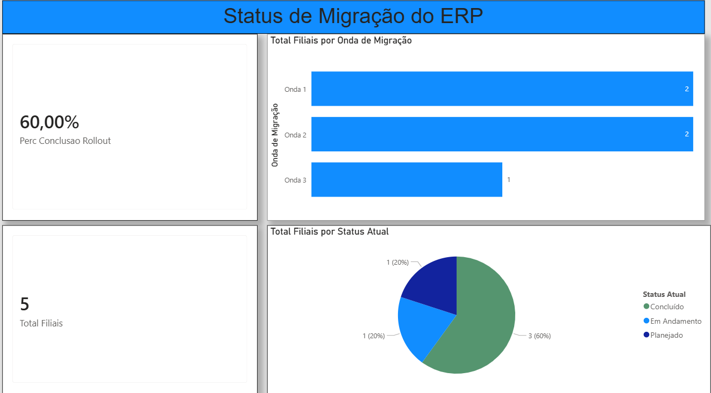

# 📊 Dashboard Executivo de Rollout de ERP

## 📝 Descrição do Projeto
Este projeto consiste no desenvolvimento de um dashboard estratégico e interativo no Power BI para gerenciar, acompanhar e garantir a visibilidade sobre o processo de implantação (rollout) de um novo sistema ERP nas filiais da empresa. 

O objetivo principal do painel é transformar dados brutos de cronogramas em insights visuais rápidos, permitindo que a diretoria e os gestores identifiquem gargalos por ondas de migração e ajam rapidamente sobre as filiais pendentes.

---

## 🛠️ Tecnologias e Ferramentas Utilizadas
* **Power BI Desktop:** Modelagem de dados, tratamento de dados (Power Query) e design de dashboards.
* **Microsoft Excel:** Utilizado como base de dados inicial (`base_indicadores_rollout.xlsx`).
* **Linguagem DAX:** Criação de métricas de negócio personalizadas para os cartões de indicadores.

---

## 📈 Indicadores e Funcionalidades Desenvolvidas

### 1. Visão Geral (Métricas Principais)
* **Percentual de Conclusão (KPI Principal):** Indicador em formato de cartão que exibe o progresso geral do projeto (`60%` concluído).
* **Total de Filiais Atendidas:** Cartão dinâmico indicando a volumetria total do escopo (`5 filiais`).

### 2. Análises Visuais
* **Distribuição por Ondas de Migração (Gráfico de Barras):** Permite enxergar com clareza o volume de filiais alocadas em cada fase/onda do cronograma, com eixos otimizados e rótulos de dados diretos.
* **Status Atual de Implantação (Gráfico de Rosca):** Visão segmentada do status das filiais. Foi aplicada a técnica de cor com propósito, destacando em verde o status "Concluído" para gerar foco imediato nos resultados alcançados.

---

## 🧠 Conceitos Aplicados & Aprendizados
Durante o desenvolvimento deste dashboard, foram aplicadas boas práticas recomendadas pelo mercado corporativo:
* **Limpeza Visual (Data-Ink Ratio):** Remoção de linhas de grade e eixos redundantes para dar mais clareza visual e fluidez à leitura dos gráficos.
* **Design de Interface (UI/UX para Dashboards):** Uso do conceito de cartões flutuantes com sombras leves sobre um fundo neutro, criando um layout limpo, escaneável e profissional.
* **Modelagem e Fórmulas:** Criação de medidas calculadas em DAX para garantir consistência e precisão matemática nos KPIs reportados.
